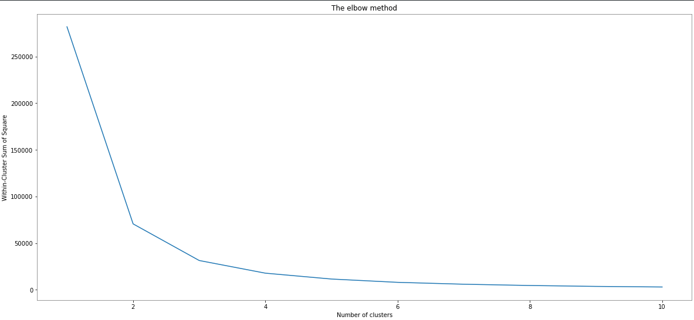

<h1 align="center">Iris Flower Cluster Prediction</h1>

## Task 2: Prediction using Unsupervised ML
#### Author: Kunwardeep Singh Jagdev
---
## Description:

Clustering is an unsupervised machine learning technique. It is the process of division of the dataset into groups in which the members in the same group possess similarities in features. The commonly used clustering algorithms are K-Means clustering, Hierarchical clustering, Density-based clustering, Model-based clustering, etc. 
- **K-Means Clustering**:
   It is the simplest and commonly used iterative type unsupervised learning algorithm. In this, we randomly initialize the K number of centroids in the data (the number of k is found using the ``Elbow method``) and iterates these centroids until no change happens to the position of the centroid.

- **Elbow Method**:
  In the Elbow method, we vary the number of clusters ( K ) from 1 – 10. For each value of K, we are calculating WCSS ( Within-Cluster Sum of Square ). WCSS is the sum of squared distance between each point and the centroid in a cluster. When we plot the WCSS with the K value, the plot looks like an Elbow. As the number of clusters increases, the WCSS value will start to decrease. WCSS value is largest when K = 1. When we analyze the graph we can see that the graph will rapidly change at a point and thus creating an elbow shape. From this point, the graph starts to move almost parallel to the X-axis. The K value corresponding to this point is the optimal K value or an optimal number of clusters.

---
## Project Goals:
- Predict the optimum of clusters from the dataset and represent it visually.
---
## Prerequisites:
In order to perform the intended test, I'll using `python3` as the main programming language and `Jupyter Notebook` as the computing platform.
I'll also require the below mentioned libraries to perform complete the task.
   1. Pandas
   2. Numpy
   3. Plotly
   4. Matplotlib
   5. Scikit-learn

If you do not have these libraries installed in your machine, Kindly run one of the below mentioned command.
> I recommend creating a `virtual environment` because it helps to keep dependencies required by different projects separate by creating isolated python `virtual environments` for them.

```bash
# if you use pip Packager
pip install pandas numpy plotly matplotlib notebook scikit-learn
```
```bash
# If you are using conda Packager
conda install pandas numpy plotly matplotlib notebook scikit-learn
```
---
## Dataset:
The dataset used in the implementation is the Iris dataset (See Table 3.1 and Fig. 3.1) with four attributes, `sepal length`, `sepal width`, `petal length`, and `petal width` and a Species label to identify the species of flower, viz., `Iris setosa`, `Iris versicolor`, and `Iris virginica`.

---
## Procedure and Result:
- Step1:
  First of all, we import the necessary library, import the dataset and slice the important features


```python
import numpy as np
import pandas as pd
import matplotlib.pyplot as plt
from sklearn.cluster import KMeans

## Importing the dataset
iris_df = pd.read_csv("./Dataset/iris.csv")

#slicing the important features
x = iris_df.iloc[:, [0,1,2,3]].values
```
- Step2:
  Now, We have to find the optimal K value for clustering the data. Now we will use the Elbow method to find the optimal K value.

```python
wcss = []

for i in range(1,11):
    kmeans = KMeans(n_clusters = i, init = "k-means++", max_iter= 300, n_init= 10, random_state= 0)
    kmeans.fit(x)
    wcss.append(kmeans.inertia_)
```
> “init” argument is the method for initializing the centroid.

- Step 3: Now that we have calculated the WCSS value for each K value. Now we have to plot the WCSS with K value
```python
plt.figure(figsize= (20,9))
plt.plot(range(1,11), wcss)
plt.title("The elbow method")
plt.xlabel("Number of clusters")
plt.ylabel("Within-Cluster Sum of Square")
```
The graph will be:



- Step 4: The point at which the elbow shape is created is 3, that is, our K value or an optimal number of clusters is 3. Now let’s train the model on the dataset with a number of clusters 3.
  
```python
## Implementing/Creating the kmeans classifier
kmeans = KMeans(n_clusters= 3, init= "k-means++", max_iter= 300, n_init= 10, random_state=0)

y_kmeans = kmeans.fit_predict(x)
```
- Step 5: y_kmeans give us different clusters corresponding to X. Now let’s plot all the clusters using matplotlib.
```python
plt.figure(figsize= (20,9))
plt.scatter(x[y_kmeans == 0, 0], x[y_kmeans == 0, 1], 
            s = 100, c = 'red', label = 'Iris-setosa')
plt.scatter(x[y_kmeans == 1, 0], x[y_kmeans == 1, 1], 
            s = 100, c = 'blue', label = 'Iris-versicolour')
plt.scatter(x[y_kmeans == 2, 0], x[y_kmeans == 2, 1],
            s = 100, c = 'green', label = 'Iris-virginica')

# Plotting the centroids of the clusters
plt.scatter(kmeans.cluster_centers_[:, 0], kmeans.cluster_centers_[:,1], 
            s = 100, c = 'yellow', label = 'Centroids')

plt.legend()
```
The graph will be:


# Conclusion:

As you can see there are 3 clusters in total which are visualized in different colors and the centroid of each cluster is visualized in yellow color.